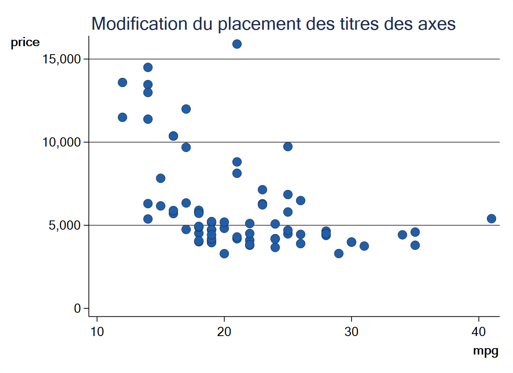
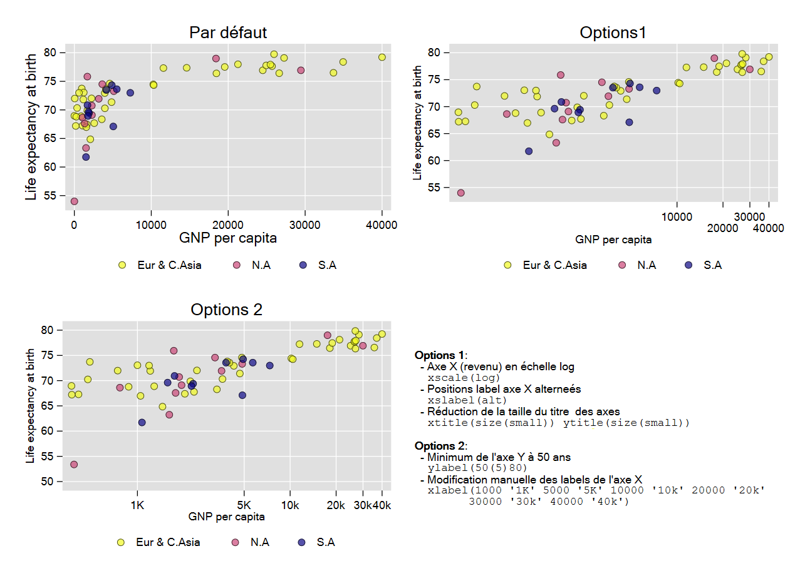
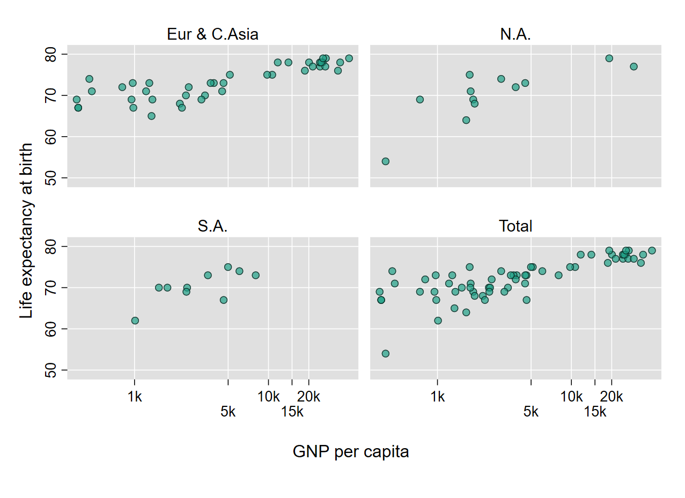
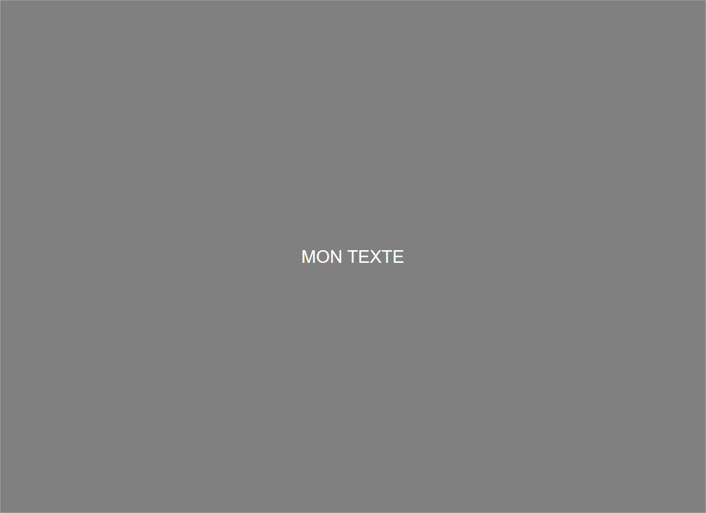
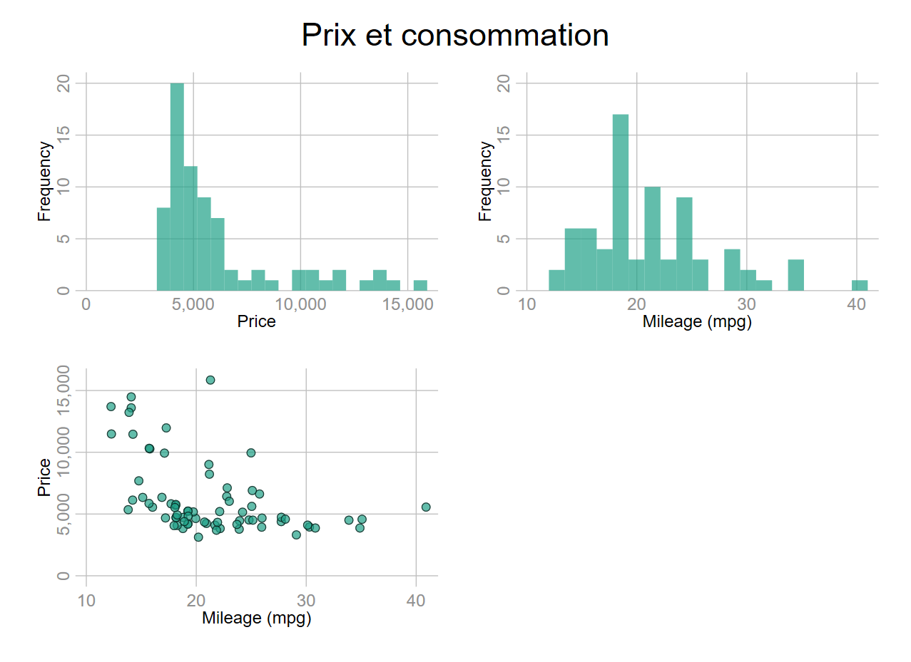
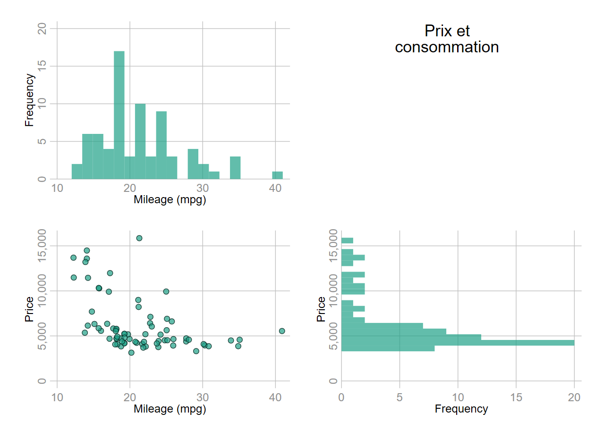

```{r setup, include=FALSE}
knitr::opts_chunk$set(echo = TRUE)

library(knitr)
library (shiny)
library (rsconnect)
library(haven)
library(pander)
library(memisc)
library(fontawesome)
library(excelR)
library(readxl)
```


<br>
Les programmes de ce chapitre sont disponibles à l’adresse :  
**https://github.com/mthevenin/stata_graphiques/blob/main/programmes/chapitre1.do**

# **Eléments de syntaxe**

## **Types de graphique** 

On peut identifier deux types de graphiques avec Stata.  

* Les ***graphiques de type one-way*** : coordonnées sur un seul axe avec ou non, un axe discret. Ils peuvent être préfixés ou non par `graph`: **`graph box`**, **`graph bar`**, **`histogram`** …..     
* Les ***graphiques de type two-way*** : coordonnées sur deux axes, optionnellement selon le type de graphique un troisième axe peut être renseigné. Ils sont préfixés ou non par `tw` (twoway) : `tw scatter`, `tw line`, …  

Certains types de graphiques sont de type oneway ou twoway. C’est le cas des histogrammes avec une commande `histogram` et une commande `tw histogram`.  
<br>
Les coordonnées sont généralement renseignées par des noms de variables. Pour certaines commandes graphiques, les valeurs sont directement renseignées: `tw scatteri` pour un nuage ou `tw pci` pour des segments [ici 4 coordonnées : (ymin, xmin) et (ymax, xmax)].    
Un graphique peut être aussi généré par une fonction : `tw function y = f(x)`.  

On peut obtenir la liste et aides des commandes graphiques officielles avec **`help graph`**.

## **Choix du délimiteur**

Un graphique peut devenir assez gourmand en options. Par défaut avec Stata l’exécution est faite ligne par ligne avec l’option par défaut `#delimit cr`.  Pour exécuter une commande sur plusieurs lignes, il est d’usage d’utiliser un triple slash **`///`**. Pour les graphiques, cette option manque de souplesse et peut provoquer des messages d’erreur lorsque **`///`** est attaché par inadvertance au dernier caractère d’une ligne.   
Lorsque le nombre de lignes devient assez conséquent, il est préférable d’utiliser **`;`** comme délimiteur. Le changement de délimiteur se fait avec **`#delimit ;`** et on indique la fin de l’exécution avec `;`. On retourne au délimiteur par défaut avec **`#delimit cr`**.  

```{}
#delimit ;
tw scatter y x,
[option1]
[option2]
[option3]
.
.
[option n]
;

#delimit cr
* Suite du programm
```


## **Eléments de syntaxe**


Pour des raisons de vocabulaire, nous allons utiliser le terme de géométrie utilisée par l’incontournable librairie **ggplot2** de **R** pour identifier un type de graphique comme scatter, line…. Mais pas seulement. en fin de document je traite de l’utilisation de la librairie **Python** **`plotnine`**, qui est un wrapper relativement complet de ggplot2, directement exécutable dans un éditeur .do ou .ado. depuis la version 16 de Stata.  
En première approche, la syntaxe d’un graphique avec Stata est particulièrement simple : 

```{}
[tw/graph] type_géométrie coordonnées [if/in] [weight], [options géométrie] [,[options du graphique]]
```

<br>

### **Un bloc d’objets graphiques (même type)**  

Un graphique comportant plusieurs géométries de même type peut être exécuté avec un seul bloc de coordonnées renseigné par des variables pour l’axe des ordonnées. Ces différentes coordonnées peuvent être des variables correspondant à plusieurs valeurs d’une variable additionnelle, souvent de type catégoriel [voir la commande separate plus bas].

```{}
[tw/graph] type_géométrie Y1 Y2 Y3.... [X] [, option1(Y1 Y2 Y3...)..options_du graphique]
```

Les options de la géométrie (plusieurs coordonnées pour Y) comme les couleurs ou les tailles/épaisseurs sont indiquées à la suite dans l’option choisie. Si on veut changer les couleurs de plusieurs courbes associées aux variable y1,y2 et y3: `color(couleurY1 couleurY2 couleurY3)`.  

***Exemple***  

Graphique de type `line`, reportant les espérances de vie aux USA de 1900 à 2000. Le premier graphique est sans option, le second en comporte.

{width=50%}


*Premier graphique (haut)*
```{}
sysuse lifeexp, clear
tw line le_male le_female year 
```

*Second graphique (bas)*
```{}
sysuse lifeexp, clear

#delimit ;
tw line  le_male le_female year, 
                                         
  lc(*.8 *1.2)                                                        
  lw(*4 *4)
                                                               
  title("Espérance de vie aux USA", pos(11))                                  
  legend(order(1 "Hommes" 2 "Femmes") pos(4) col(1) ring(0))             
  ylabel(35(5)80, angle(0))  
  xtitle("Année")   
  graphr(color(white)) plotr(color(white))
;
```

<div class="alert alert-warning">
`r fa("thumbs-up", fill = "steelblue", height = "1em", margin_right="1em")` Avec le changement de délimiteur, il est plus facile de distinguer les différents éléments du graphique, comme les options qui affectent directement les courbes (couleur, épaisseur) et les options générales du graphique (titre, légende, labels de y à l’horizontal, titre de x, couleur de fond).
</div>

***Options des courbes***:   

*	`lc(...)`: je baisse la saturation de la courbe des hommes de 20% (plus claire) et j’augmente celle des femmes de 20% (plus foncée). Les couleurs par défaut sont conservées (palette Stata s2color).
*	`lw(...)`: j’augmente fortement l’épaisseur des courbes (*4). Stata dispose de plusieurs unités pour altérer les tailles et épaisseurs, celle utilisée par défaut est une unité de type relative (voir la section dédiées plus bas).

***Options du graphique***: 

*	J’ajoute un titre avec l’option `title(…)` que je positionne à 11 heures à l’extérieur avec l’argument `pos(11)`.
*	Je change les labels de la légende dans l’option `legend(...)` avec l’argument `order(...)`. Je change la position de la légende en a mettant dans la zône du graphique avec `ring(0)` et à 4 heures avec `pos(4)`. Les labels sont reportés sur une colonne avec l’argument `col(1)`.
*	Je modifie les labels des ordonnées avec l’option `ylabel(...)`, en changeant le delta des coordonnées reportées et en mettant les labels à l’horizontal avec l’argument `angle(0)`.
*	Je modifie le titre des abscisses avec l’option `xtitle(...)`.
*	Je modifie les couleurs de fonds du graphique qui est composée de deux zônes: la zône où est réellement tracé le graphique avec l’option `plotr()` [ou `plotregion(...)`] et la zône externe avec `graphr(...)` [ou `graphregion(...)`] où se trouve reporté par défaut les titres et les légendes. Pour changer la couleur de fond, on utilise l’argument `color(...)`.


### **Plusieurs blocs d’objets graphiques**


Dans l’exemple précédent on avait deux variables, mais il est plus standard que les bases donnent des observations à partir d’une variable qui peut être croisées avec d’autres informations regroupées avec une variable discrète. Par rapport à d’autres langages graphiques, on pense bien évidemment à R avec ggplot, les choses se gâtent un peu du côté de Stata car plusieurs graphiques doivent être exécutés séparément dans la même commande. On donnera plus loin un moyen via les macros et les boucles d’automatiser cette exécution. Cela ne concerne que les éléments surperposés, Stata possédant en revanche une option pour générer des sous graphiques de type facettes ou small-multiple (voir section sur les graphiques combinés).  
Chaque sous graphique a son propre jeu d’options et ont doit bien indiquer leur séparation, soit avec des parenthèses soit avec des doubles barres horizontales.  

```{}
(graph 1, options graph1) (graph2, options graph2)… (graph n, option graph n) , options graphiques
```

ou

```{}
graph 1, options graph1 || graph2, options graph2 ||…. || graph n, option graph n || , options graphiques
```

Ma préférence va plutôt à la deuxième solution pour éviter une surabondance de parenthèses déjà très présentes, et souvent imbriquées dans les options. Par ailleurs il me semble qu’on visualise mieux la séparation entre les différents éléments graphiques.  


Principe de la syntaxe avec `;` comme délimiteur  

*Graphiques séparés par ()*
```{}
#delimit ;
[tw/graph] 
(type_géométrie1 Y1 [X1] [Y2] [X2] [Z] [in if] [weight]
[, options(1)]) 
  
(type_géométrie2 Y2 [X1] [Y2] [X2] [Z] [in if] [weight]
[, options(2)])
...)
                                    
[, options_graphiques] 
; 
```


*Graphiques séparés par ||*
```{}
#delimit ;
[tw/graph] 
   type_géométrie1 Y1 [X1] [Y2] [X2] [Z] [in if] [weight]
[, options(1)] 
  
|| type_géométrie2 Y2 [X1] [Y2] [X2] [Z] [in if] [weight]
[, options(2)]) 

...                                    
|| [, options_graphiques] 
;  
```


***Exemple***  

Comme dans le premier graphique, celui du haut est sans option et celui du bas avec.  On va afficher un nuage de point avec la base auto, entre les variables price et mpg (consommation d’essence en gallon) selon l’origine de la voiture (US ou autres pays).

{width=50%}


*Premier graphique*
```{}
sysuse auto, clear

#delimit
tw 
    scatter price mpg if !foreign
||  scatter price mpg if  foreign

||, legend(order(1 "US" 2 "Autres"))
;
```


<div class="alert alert-info">
`r fa("info", fill = "steelblue", height = "1em", margin_right="1em")`
Lorsqu’on superpose les sous graphiques de cette manière, Stata ne reconnait pas par défaut les labels à affecter à la légende, et affiche deux fois le label price pour chaque origine. On doit renseigner manuellement cette information. Petite astuce pas forcément connue de toutes et tous. Lorsqu’une variable est de type indicatrice {0,1} il n’est pas nécessaire de préciser sa valeur:

* `!foreign` est identique à `foreign==0`
* `foreign`  est identique  à `foreign==1`
</div>


*Second graphique*  

```{}
#delimit ;
tw 
   scatter price mpg if !foreign, 
   mc("31 161 135%60") msize(*1.5) mlc(black) mlw(.3) jitter(1)
|| scatter price mpg if foreign, 
   mc("207 225 28%60") msize(*1.5) mlc(black) mlw(.3) jitter(1) 

||, title("{bf: Prix et consommation selon l'origine}", pos(11))   
    legend(order(1 "US" 2 "Autres"))
    ylabel(5000 “5k” 10000 “10k” 15000 “15k”, angle(0)) 
    xtitle("Consommation (miles par gallon)") 
    ytitle("Prix")
    graphr(color(white)) plotr(color(white))
;
```


***Options des nuages***   

*	`mc(...)` modifie la couleur des bulles. On verra par la suite plus en détail les altérations des couleurs, mais ici on a manuellement changé leur couleur avec un code RGB sur lequel on a réduit l’opacité à 60% (ou mis 40% de transparence).
*	`mlc(...)` modifie la couleur du contour des bulles, ici en noir. Par défaut la couleur du contour est identique à la couleur de remplissage de la bulle.
*	`msize()` modifie la taille de la bulle.
*	`mlw()` modifie l’épaisseur du contour de la bulle.
*	`jitter()` : très à la mode, les jitters sont des nuages dont les coordonnées ont été perturbées aléatoirement pour réduire les effets de superposition, ici liés à la variable mpg. A utiliser avec prudence, et éviter de trop modifier les coordonnées lorsque les coordonnées représentent des valeurs continues.   

***Options du graphique***  

*	Le titre a été mis en gras avec une balise SMCL (Stata Markup Control Langage) : `"{bf :texte}"`.
*	Les valeurs des prix reportés sur l’axe des ordonnées à été modifié manuellement avec des unités k (1k = 1000).
*	Le reste des options sont de même nature que celles relative au graphique précédent sur les espérances de vie.

# **Options**

Il s’agit ici d’un tour d’horizon forcément incomplet des options qui vont permettre de modifier et d’habiller les graphiques, afin d’en améliorer la visibilité. On va regarder principalement les options liées aux couleurs, tailles/épaisseurs ; et quelques paramètres de bases pour les axes, légendes, titres. L’idée est de ne traiter que des options qui sont utilisées au moins une fois dans le document.


Un très bon cheat sheet:   
* https://geocenter.github.io/StataTraining/pdf/StataCheatSheet_visualization15_Syntax_2016_June-REV.pdf
* https://geocenter.github.io/StataTraining/pdf/StataCheatSheet_visualization15_Plots_2016_June-REV.pdf


## **Couleurs et épaisseurs**

### **Couleurs**

***Se reporter au chapitre 3, pour un tour d’horizon plus complet sur les couleurs et les palettes de couleurs [mettre lien]***

3 Eléments entrent dans les options relatives aux couleurs.

**Nom - code couleur**
Un nom de couleur prédéfini ou un code couleur numérique : la couleur `navy` (première couleur de la palette Stata *s2*) a pour code RGB [Red-Green-Blue] `"26 71 11"`.  
Pour un élément de type ligne, courbe… : **`lc(navy)`** = **`lc("26 71 11")`**  


**Saturation/intensité**
On peut modifier la saturation : clair (blanc) <=> foncé (noir). Une couleur par défaut ou renseignée manuellement a une intensité de 1. On tire vers le blanc en réduisant cette saturation, vers le noir en l’augmentant.  Après le nom ou le code couleur, l’intensité est modifiée par **`*#`** avec # supérieur ou égal à 0 (0=blanc).  
Pour un élément de type barre, l’option pour modifier une couleur est donnée par `fc()` (f pour fill, c pour color tronqué) : `fc(*.5)` réduit la saturation de 50% de la  couleur par défaut, `fc("26 71 11*1.2")` augmente de 20% la saturation de la couleur navy, ici renseignée par son code RGB.  

**Transparence**
En retard sur ce point jusqu’à la version 15 de Stata, on peut maintenant modifier l’opacité (transparence) des couleurs.
La transparence permet de gérer les effets de superposition, mais on doit se méfier des effets de flou qui peuvent se révéler assez désagréable, en particulier pour les nuages en l’absence de contour sur les bulles. L’argument de l’option exprime un pourcentage d’opacité avec comme valeur minimale 0 et une valeur maximale 100 (100 = valeur par défaut). Après le nom ou le code de la couleur, l’opacité est réduite par %#. On peut utiliser une transparence totale (%0) pour cacher des éléments d’un graphique.  
 
Pour un élément de type bulle : `mc(%50)` réduit de moitié l’opacité de la couleur par défaut, `mc("26 71 11%70")` applique 70% de transparence à la couleur navy.  

Comme on le voit dans le second graphique ci-dessous, il n’y a pas trop de sens à baisser simultanément la saturation et l’opacité, une couleur plus transparente étant plus claire. On peut à l’inverse augmenter la saturation et baisser l’opacité.   

{width=50%}

{width=50%}

{width=50%}

Le tableau qui suit donne le nom des options relatives aux couleurs, avec leur expression tronquée (color = c). Comme un nombre important de types de géométrie peuvent être associés à tw line dont ils partagent les options, ils ne sont pas forcément tous recensés (help twoway).


Warning: ne pas utiliser le mode nuit pour consulter les tableaux suivants.  

```{r, echo=FALSE, message=FALSE, warning=FALSE}
columns = data.frame(width= c(300, 300,300))
```

**Graphiques two way**
```{r, echo=FALSE, message=FALSE, warning=FALSE}
c1 <- read_excel("D:/D/Marc/SMS/Groupe_Stata/Graphiques/options couleurs.xlsx", sheet = "Feuil1")
excelTable(data=c1)
```

**Graphiques oneway**
```{r, echo=FALSE, message=FALSE, warning=FALSE}
c2 <- read_excel("D:/D/Marc/SMS/Groupe_Stata/Graphiques/options couleurs.xlsx", sheet = "Feuil2")
excelTable(data=c2)
```

**Axes**
```{r, echo=FALSE, message=FALSE, warning=FALSE}
c3 <- read_excel("D:/D/Marc/SMS/Groupe_Stata/Graphiques/options couleurs.xlsx", sheet = "Feuil3")
excelTable(data=c3)
```

**Légendes**
```{r, echo=FALSE, message=FALSE, warning=FALSE}
c4 <- read_excel("D:/D/Marc/SMS/Groupe_Stata/Graphiques/options couleurs.xlsx", sheet = "Feuil4")
excelTable(data=c4)
```

**Titres, notes, texte libre**
```{r, echo=FALSE, message=FALSE, warning=FALSE}
columns = data.frame( width= c(300, 300,300), type=c('text', 'text', 'text')) 
c5 <- read_excel("D:/D/Marc/SMS/Groupe_Stata/Graphiques/options couleurs.xlsx", sheet = "Feuil5")
excelTable(data=c5, columns = columns)
```


### **Tailles/épaisseurs**

On peut altérer les tailles et épaisseurs d’éléments composants le graphiques en s’appuyant soit sur des arguments prédéfinis, soit en jouant sur les valeurs de plusieurs types d’unités, absolues (cm, point, pouce) ou relatives. Certaines ont été implémentées à la version 16 de Stata. 
Lorsqu’elles sont prédéfinies, leur mémorisation peut s’avérer un peu laborieuse avec une liste qui diffère selon le type d’objet. On peut donc privilégier la modification directe des valeurs en choissisant des unités absolues (pouces, cm) ou relative. Dans mes graphiques, je priviliégie sauf exception l’utilisation de valeurs relatives.


***Tailles prédéfinies***  

{width=50%}

<br>
{width=50%}

<br>
{width=50%}

***Tailles reposant sur des valeurs***  

Pour modifier directement les valeurs des tailles et épaisseurs Stata propose 6 unités : 3 absolues et 3 relatives. Ces dernières sont un peu obscures au niveau de la définition de la valeur de référence. `#` donne la valeur de la modification.  

Absolues (par ordre décroissant) : le pouce (`#in`), le centimètre (`#cm`), et le point (`#pt`).  
<br>
Relatives:  

-	`option(#rs)`: valeur relative par rapport au minimum de la longueur et de la largeur du graphique (=100). Si option(.5rs) et que le graphique fait 10 de largeur et 20 de longueur, la référence est associée à la largeur et est égale à 100. La taille ou l’épaisseur de l’élément fera alors .5% de cette référence. L’aide de Stata ne s’attarde pas sur ce type de modification, pas forcément très claire.

-	`option(#)` : également une valeur par rapport au minimum de la largeur et de la longueur, mais on garde cette valeur comme référence. Avec option(.5) et que le minimum est toujours égal à 10 (largeur), la taille ou l’épaisseur de l’élément est égale à .5% de 10.

-	`option(*#)` : coefficient multiplicateur d’une taille ou épaisseur par défaut définie par le style (thème) du graphique. Je privilégie ce type de paramétrisation. Sauf exception, j'utilise cette option.

{width=50%}


`r fa("question-circle", fill = "steelblue", height = "1em", margin_right="1em")`**Exercice**  
<br>
Reproduire les deux graphiques ci-dessous avec la base auto: `sysuse auto.dta`.  

Programmes : https://github.com/mthevenin/stata_fr/blob/master/exercices/exo1

<div class="alert alert-success">
**Graphique(s) 1**  

-	Reproduire l’un et/ou l’autre de ces graphiques avec les variables *mpg* et *foreign*.
-	Les histogrammes sont générés avec la fonction **`tw histogram`** (à préférer à la commande de type oneway `histogram`).
-	Les densités sont estimées avec la fonction **`kdensity`** [`help kdensity`] et le graphique est généré avec **`tw area`** [`help twoway area`].
-	Les couleurs sont issues de la palette de type séquentielle **YlGnBu** de la collection Brewer (voir le chapitre sur les palettes de couleur). les codes des deux couleurs sont **`"34 94 168"`** et **`"139 209 187"`**.
<hr>
{width=60%}
</div>


<div class="alert alert-success">
**Graphique(s) 2** 

-	Nuage de points des variables price et mpg pour les deux modalités de la variable foreign, avec report des OLS. 
-	La droite de l’OLS est générée avec le type de graphique tw lfitci:
  -	Couleur de la droite : option **`clc()`**
  -	Couleur de remplissage l’intervalle de confiance: option **`fc()`**
  -	Couleur du contour de l’intervalle de confiance: option **`alc()`**
<hr>
{width=60%}
</div>

## **Options pour les axes**

<u>Remarque</u> : on se limitera aux axes classiques (x,y). Dans les cas particuliers des dates et des graphiques admettant un 3ème axe (graphique type contour), les options sont précédées du préfixe `t` ou `z`.  

Il y a 3 types options pour modifier les axes x/y x : **`x/ylabel()`**,  **`x/ytitle()`**, **`x/yscale()`**.
Une autre option permet de définir le choix de l’axe si un graphique comporte plusieurs définitions d’axes pour les abscisses et/ou pour les ordonnées : **`x/yaxis(#)`** avec `#` le numéro de l’axe, qui sera par la suite reporté dans les autres options relatives aux axes.  

### **Titres des axes**

```{}
xtitle() ytitle():  xtitle(["titres"] [, options])
```

Principales options:  

-	Taille avec `size(...)`, couleur avec `color(...)`. Si on ajoute l’option `box(...)`, on peut modifier l’apparence de la zone qui l’entoure.
-	Titres sur plusieurs lignes: **`xtitle("ligne1" ligne2"....[, options])`**
-	On peut modifier la position des titres des axes avec `place(top/right/bottom/left)` pour indiquer la position le long de l’axe (par exemple `right` pour x et `top` pour y) et contrôler leur éloignement de l’axe avec `width(#)` pour y et `height(#)` pour x. Le graphique suivant modifie les positions par défaut des titres :  

```{}
xtitle(", place(right) height(5)) 
ytitle(", orient(horizontal) place(top) width(5))
```

{width=50%}

### **Coordonnées, labels, grid**

```{}
xlabel() ylabel(): xlabel([coordonnées] [,options])
```

***Modification des valeurs reportées sur les axes***:  

*	Avec **valeur_min(delta)valeur_max**: `xlabel(0(10)100)` => de 0 à 100 avec un incrément de 10.
*	En indiquant le nombre de valeurs à reporter sur l’axe : `xlabel(#)`.
*	Manuellement: `xlabel( #1 #2 "label" "label2"…)`  ou   `xlabel( #1 "label1" #2 "label2"...)`.  
*	On peut mélanger les approches : `xlabel(0 .5 1(1)10 15 20 "Vingt" )`.


***Principales options***:  

*	Taille et couleur du texte avec **`labs(...)`** et **`labc(...)`**.
*	Alterner les positions pour éviter les chevauchements avec `alt`.
*	Modifier l’angle de report des labels : `angle(#)` avec # valeur de l’angle [0 (horizontal), 45, 90 (vertical) …].
*	Modification du grid et des coches (tick) : la couleur avec `glc(...)` et `tlc(...)` et l’épaisseur avec `glw(...)` et `tlw(...)`.

### **Echelles**

```{}
xscale() yscale() 
```

*	Utilisation d’une échelle logarithmique : *`log`*. Seule l’échelle est modifiée, les valeurs d’origines sont reportées sur l’axe, ce qui est plutôt bien vu.
*	Echelle en ordre décroissant : `reverse`. Pas conseillé, mais on peut trouver une certaine utilité aux graphiques combinés reportant des distributions croisées et marginales (voir la section dédiée aux graphiques combinés).
*	Supprimer l’affichage des axes : `off`.
*	Ne pas tracer la ligne parcourant l’axe : `noline`.
*	Modifier les limites de l’axe : `range(min max)`. Plutôt utile pour l'ajout d'éléments de type texte proche des axes.   

Les graphiques suivant donnent quelques exemples de modification des options des axes. Les données sont issues de la base d’exemple *lifeexp* [`sysuse lifeexp, clear`] et les graphiques reportent sous forme de nuage les espérances de vie à la naissance (y) et le revenu par habitant (x).

{width=90%}
<div class="alert alert-danger">
 La zône en bas à droite étant un graphique « vide » avec seulement une note, pour la dernière option reportée le label doit-être indiqué par des doubles quotes "label" et non par ‘label’: xlabel(1000 "1k" 5000 "5k" 10000 "10k" 20000 "20k" 30000 "30k" 40000 "40k") et non xlabel(1000 ‘1k’……). Il m’a fallu composer avec la syntaxe permise pour les éléments de type texte.
</div>

## **Options pour la légende**

```{}
legend(), clegend(), plegend: legend(contenu [options])
```

Les options **`clegend()`** et **`plegend()`** sont réservées aux graphiques de type courbes de niveau avec une troisième dimension (hauteur, densité…): `clegend()` pour `tw contour` et `plegend()` pour `tw contourline`. Ces options ont des arguments spécifiques que je ne décrirais pas ici.  

Stata utilise par défaut le label de la variable y pour alimenter le contenu de la légende, ce qui peut conduire à un rendu inadapté qu'il faudra corriger manuellement ou à l'aide de macros et fonctions macro (voir chapitre2).  

*	Ne pas afficher une légende: **`legend(off)`**. 
*	Position par défaut: 6 heures (Sud) – à l’extérieur. Modifiable avec `pos(#)` et `ring(0 ou 1)`. 
*	Pour modifier le nombre de lignes et de colonnes: `row(#)` et `col(#)`.
*	Pour modifier les labels de la légende:
  * **`order(...)`** : `order( 1 "label1" 2 "label2" .....)` ou
  * **`lab(...)`** : `lab(1 "label1") lab(2 "label2") ...)`
  
J’utilise de préférence order plus parcimonieux en parenthèses.  L’apparence (gras, italique…) des labels est modifiable avec des balises smcl ; les tailles et couleurs sont également modifiables avec des options pour les textes.  

-	Les labels peuvent être reportés sous les symboles avec l’option **`stack`**.
-	On peut modifier l’aspect de la zône (couleur du fond, contour…) avec la sous option **`region(...)` ou `r(...)`.


**Le smcl**
<div class="alert alert-info">
<strong>Le smcl</strong>  
Le Smcl « **Stata Markup Control Langage** » est le langage d’édition de Stata, il faut le reconnaître un peu préhistorique (ce n’est pas du Markup pour rien). Pour les graphiques, il permet de modifier les textes des titres, labels des axes, contenu des légendes : gras, italique… changement de police, ajout de formules.   
Balise smcl : `"{type_option: texte}"`  

Quelques options/modifications de base :  

* Gras : `"{bf: texte}"`
* Italique : `"{it: texte}"`
* Gras et italique : `"{bf:{it :texte}}"`        
* Le choix des polices dépend du système d’exploitation. Elles sont sélectionnées par leur type : `"{stSans : texte}"` pour type sans serif,  `"{stSerif : texte}"`  pour type serif, `"{stMono: texte}"` pour type mono, et  `"{stSymbol : texte}"` pour les lettres grecques ou les symboles mathématiques. Exemples de polices avec windows : *arial* (sans serif), *times new roman* (serif), *courrier new* ou *consolas* (mono) et *symbol* (symbol).
On peut également utiliser toutes les typographies disponibles en les sélectionnant en amont, avec la commande `graph set`.
</div>

{width=90%}


Options de la légende :  
```{}
legend(order(1 "{bf:Domestic}" 2 "{bf:Foreign}") pos(1) ring(0) col(1) region(lw(*.1)) stack )
```

*	Le texte de labels a été mis en gras avec une balise Smcl.
*	La légende a été positionnée à l’intérieur du graphique avec `ring(0)` et à 1 heure avec `pos(1)`.
*	La légende est reportée sous forme de colonne avec `col(1)`.
*	L’épaisseur du contour de la zône a été fortement réduit avec `r(lw(*.1))`.
*	Le texte est positionné sous le symbole avec l’option `stack`.

## **Options pour les titres, notes, texte libre**

La majeure partie des options sont déjà précisées plus haut pour les titres des axes.  Les titres et les notes sont comme les légendes positionnés par rapport à des valeurs de l’horloge (de 1 à 12). Pour le texte libre on renseigne directement les coordonnées.    

**`title()`** – **`subtitle()`**   
Il y a également des options pour des titres qui sont positionnés à gauche, à droite, au dessus (mais en dessous du titre principal) ou en bas du graphique :`l1title()` et `l2title()` pour un titre à gauche (l pour left), `r1title()` et `r2title()` à droite (r pour right), `t1title()` et `t2title()` pour un titre au dessus (t pour top) et ,enfin, `b1title()` et `b2title()` pour un titre en bas (b pour bottom) .   
Par défaut le titre principal est positionné à 12 heures. Le sous titre est positionné en dessous du titre principal.  

**`note()`** – **`caption()`**  
`note()` est positionné par défaut à 6 heures, `caption()` en dessous de note(). 
Ces options permettent de faire des notes de lecture ou de préciser une ou plusieurs sources au graphique. 

**`text(coordonnées "texte" [,options])`    
Cette option permet d’afficher un texte dans la zône du graphique en entrant directement les coordonnées (y,x). Les sous options relatives à l’alignement peuvent être assez utiles si on ne veut pas tâtonner avec les coordonnées [on peut passer par les macros pour générer les coordonnées, voir le chapitre dédié].  

Le graphique suivant présente les options par défaut (position, taille, couleur) des titres, dont le titre des axes, ainsi qu’un texte libre positionné aux coordonnées (1,1).

{width=60%}

## **Autres**

### **Changer la police par défaut**

On peut paramétrer en amont la typographie utiliser par les graphiques avec la commande `graph set` 

```{}
* pour OS windows
graph set window fontface[type_police] "nom_police" 
```

Le type de police est: *sans*, *serif*, *mono*, *symbol*.  

Par défaut:  
```{}
   window           current
   setting          default          choices
   ----------------------------------------------------------------
   fontface         Arial             font name
   fontfacesans     Arial             font name
   fontfaceserif    Times New Roman   font name
   fontfacemono     Courier New       font name
   fontfacesymbol   Symbol            font name
   ---------------------------------------------------
```


Exemple: avec Trebuchet MS pour fontface et consolas pour mono

```{}
graph set window fontface"trebuchet MS"
graph set window fontfacemono "consolas"

/*
   window           current
   setting          default          choices
   ------------------------------------------------------------------------
   fontface         trebuchet MS      font name
   fontfacesans     Arial             font name
   fontfaceserif    Minion Pro        font name
   fontfacemono     consolas          font name
   fontfacesymbol   Symbol            font name
   ------------------------------------------------------------------------
*/
```


### **Taille du graphique**

Ces options sont particulièrement utiles pour les graphiques combinés lorsque l’empilement de plusieurs graphiques provoque un effet d’écrasement des axes (axes x plus court si plusieurs colonnes par exemple).  

* **`xsize(#)`** - **`ysize(#)`** : en pouce (max=20). Peut s’appliquer à un graphique individuel, ou plus souvent à la commande `graph combine` pour retrouver un bon ratio x/y pour les sous graphiques.
* **`fxize(#)`** – **`fysize(#)`** : # en %. A utiliser seulement pour combiner des graphiques. Avant la combinaison on peut appliquer ces options aux graphiques individuels pour contrôler les ratios x/y. Cela permet plus de liberté dans les compositions des graphiques combinés.  

Une application est donnée plus loin dans la section dédiée aux graphiques combinés.

<br>

### **Modifier automatiquement la taille du texte et des symboles**

**`scale(#)`** – **`iscale(#)`*  
Permet de modifier la taille des éléments types texte et symboles générés par un graphique. Utile lorsque le texte d’une légende sort du contour. Valeur de référence=1.  
Pour la commande `graph combine`, on utilise l’option `iscale()` qui appliquera la modification à tous les sous graphiques.

<br>

### **Options d’affichage et d’enregistrement** 

* **`nodraw`**   
Equivalent de `quietly` pour les graphiques, il permet de ne pas afficher le graphique dans l’éditeur. Plutôt à utiliser pour les sous-graphiques qui seront combiner ou associer à l’option `saving()`. Cela permet de gagner un temps d’exécution non négligeabe.


* **`name()`**: `name(nom_graph [,replace])`  
Permet de sauvegarder temporairement le graphique sur la session. On peut privilégier cette option pour combiner des graphiques ultérieurement.  
Utiliser de préférence l’option `replace` pour écraser un graphique déjà en mémoire et avec un même nom, à défaut de quoi il faut supprimer le ou les graphiques en mémoire avec `graph drop noms_graphs` ou `graph drop _all` en amont.

* **`graph display [nom_graph]`**  
Permet d’afficher un graphique en mémoire (non sauvegardé en dur). Si le nom du graphique n’est pas précisé, le dernier graphique généré est ouvert dans l’éditeur de graphique.

Exemple:
```{}
 graph display g1
```

* **`saving("path/nom"[, replace])`**  
Même principe que `name()`, mais sauvegarde en dur sur le disque.   


* **`graph use "nom_graph"`**  
Permet d’afficher un graphique enregistré.


* **Exporter un graphique**  
`export nom_graph.format [, replace name(nom du graphique ouvert dans l’éditeur)]`.
Stata peut convertir un graphique en plusieurs format : jpeg, png, gif (seulement mac), svg…. On peut le faire directement dans l’éditeur de graphique ou passer par la ligne de commande export. Pour utiliser cette commande, le graphique doit être ouvert dans l’éditeur. Les formats d’exportation on des options propres.

Exemples:
```{}
tw line y x
graph export graphpng.png
tw line y x, name(g1,replace)
graph export graphpng.png, replace name(g1)
```


# **Combiner des graphiques**

## **Facettes automatiques**

Les facettes ou *small multiples* permet de combiner rapidement plusieurs graphiques répétés pour différentes valeurs d’une variable additionnelle, généralement catégorielle. Stata est plutôt efficace pour produire ce genre de visualisation avec l’option `by()` dans la commande graphique. On peut néanmoins regretter le manque de possibilité concernant l’habillage des sous graphiques avec, par exemple, une même couleur imposée à l’ensemble des sous graphiques.  


**Syntaxe** : `graphique, by(variable [, total col(#) row(#)…])…`  
Avec l’argument `total` en option de `by()`, on peut ajouter un graphique additionnel représentant le graphique avec toutes les valeurs, donc celui sans l’option by. On peut également modifier la répartition des sous-graphiques par ligne et colonne avec `row()` et `col()`.
Le graphique génère automatiquement une note « Graphs by nom_variable » plutôt dispensable. Si l’on souhaite supprimer cette note, on ajoute `note(" ")` en option de `by()`.  

***Exemple***

```{}
sysuse lifeexp
#delimit ;
tw scatter lexp gnppc, 
by(region, total note(" "))
mc("31 161 135%70") mlc(black) mlw(*.6)

xlabel(1000 "1k" 5000 "5k" 10000 "10k" 15000 "15k" 20000 "20k" , alt)
xscale(log)
;
```

{width=60%}

## **Combinaison libre**

Deux commandes sont disponibles pour combiner plusieurs sous-graphique:  

-	**`graph combine`**: commande officielle.
-	**`grc1leg`**: commande externe qui permet d’afficher une seule légende lorsque les sous graphiques partagent la même légende. Installation : `ssc install grc1leg`.  

### Conseils et options pour les sous-graphiques

-	Les sous-graphiques devant être enregistrés, préférer `name(nom, replace)` à `save(path/nom, replace)`.
-	Une fois les sous-graphiques validés, utiliser l’option **`nodraw`** pour raccourcir le temps d’exécution.
-	**`margin(#1 #2 #3 #4)`** : si l’on souhaite modifier l’espace entre les sous graphiques on peut utiliser cette sous-option de l’option `graphr()`. Par défaut `margin(0 0 0 0)` avec `margin(left right top bottom)`. L’application en fin de section précisera par l’exemple l’intérêt de cette option. Voir également `imargin()` plus bas pour appliquer automatiquement une modification identique à tous les sous graphiques.
-	Lorsqu’un graphique sera combiné à un autre, les options `xsize()` et `ysize()` sont sans effet. On peut alors utiliser les options **`fxsize()`** et **`fysize()`**. De même, l’option `scale(#)` est sans effet et sera remplacée par l’option **`iscale()`** du graphique combiné.  

-	**Générer un graphique vide**: en particulier lorsque le nombre de sous-graphiques est impair, on peut générer un ou plusieurs graphiques vides pour ajouter un titre, une note…., ou affiner la mise en page. La syntaxe de ce graphique est donnée ci-dessous, ainsi qu’un moyen de récupérer facilement sa syntaxe via une macro enregistrée en dur.

**Graphique vide**  

***Syntaxe***  
```{}
tw scatteri 1 1, ylab(,nogrid) xlab(,nogrid) mc(%0) xtitle("") ytitle("") yscale(off noline) xscale(off noline) name(gv,replace) 
```

Pour récupérer cette syntaxe on peut l’enregistrer dans une macro en dur, de type global. On peut soit exécuter directement ce graphique vide, soit le modifier pour ajouter, par exemple, un élément de type texte, ou modifier son habillage comme la couleur de fond.    

***Enregistrement dans une macro***

```{}
global gvide "scatteri 1 1, ylab(,nogrid) xlab(,nogrid) mc(%0) xtitle("") ytitle("") yscale(off noline) xscale(off noline) name(gv,replace)"
```

***Exécution directe du graphique vide sans affichage (ajout de `nodraw`)***

```{}
tw $gvide nodraw
```

***Récupération de la syntaxe et ajout d’un texte libre et modifier l’habillage***  

```{}
mac list gvide
tw $gvide text(1 1 "MON TEXTE", color(white)) ///
          graphr(color(gs8)) plotr(color(gs8))
```

{width=60%}

### Syntaxe et options

**Syntaxe générique**

```{}
graph combine liste_sousgraph [, col() row() xsize() ysize() iscale() xcommon 
ycommon …..]
```

```{}
grc1leg graph combine liste_sousgraph [, legendfrom(nom_graph) col() row() xsize() ysize() iscale() xcommon ycommon…..]
```

<br>
**Options du graphique combiné**

-	`col(#)` et `row(#)` permettent d’indiquer le nombre de colonnes et de lignes pour la mise en page. 
-	`xsize(#)` et `ysize(#)` permettent de contrôler les effets d’écrasement si le nombre de colonnes et de ligne n’est pas identique. max(#)=15.
-	`iscale(#)` permet de réduire les éléments types texte et symbole pour l’ensemble des sous graphique (remplace `scale()` pour un graphique individuel).
-	`imargin(#1 #2 #3 #4)` modifie pour chaque sous graphique la distance en la limite de la zône du graph (`graphr`) et le bord du graphique. Dans l’ordre `imargin(left right top bottom)`. Par défaut `imargin(0 0 0 0)`, des valeurs positives augmentent la distance, des valeurs négatives la réduise. 
-	`xcommon`  et `ycommon` forcent les graphiques à partager les même valeurs pour les axes.  

-	`legendfrom(nom_graph)`: pour la commande **`grc1leg`** seulement, permet d’afficher une seule légende lorsque les sous-graphiques partage la même.

<br>
**Application**  

L’idée est de proposer un graphique devenu assez standard en visualisation, représentant pour deux variables continues leur distribution croisée, ici sous forme d’un nuage, et leur distribution marginale, ici sous forme d’histogramme. Ce type de graphique est également souvent représenté dans une version combinant des courbes de niveaux et des densités simples.  
On prendra ici de nouveau les variables *price* et *mpg* de la base *auto*.  
Dans un premier temps on combinera simplement les 3 graphiques, dans un second temps on ajoutera un graphique vide avec un élément titre à la seconde colonne de la première ligne, enfin on proposera un graphique définitif avec deux variantes, qui modifie la position du titre.   
Au niveau des options je n’ai pas reporté les altérations du style par défaut pour alléger le report de la syntaxe.  

***Graphique combiné simple***  

```{}
sysuse auto
#delimit ;
histogram price, bin(20) freq
fc("31 161 135%70") lc(%0) mlw(*6)  
name(g1,replace) 
;
histogram mpg, bin(20) freq
fc("31 161 135%70") lc(%0) 
name(g2,replace) 
;
tw scatter price mpg,  
mc("31 161 135%70") mlc(black) mlw(*.6)  
jitter(1) 
name(g3,replace)
;
graph combine g1 g2 g3, title("Prix et consommation")
;
```

{width=60%}

On ajoute un graphique vide dans lequel on indiquera le titre du graphique, et on positionne l’histogramme de la variable price à l’horizontal (option `horizontal`) :

```{}
tw $gvide title("Prix et" "consommation")

#delimit ;
histogram price, bin(20) freq
fc("31 161 135%70") lc(%0) mlw(*6)  
horizontal
name(g1,replace) 
;

histogram mpg, bin(20) freq
fc("31 161 135%70") lc(%0) 
name(g2,replace) 
;

tw scatter price mpg,  
mc("31 161 135%70") mlc(black) mlw(*.6)  
jitter(1) 
name(g3,replace)
;
graph combine g2 gv g3 g1 ;
```

{width=60%}

Pour la version suivante, on va réduire la taille des abscisses pour g1 (*price*) et le graphique vide, la taille des ordonnées pour g2 (*mpg*) et le graphique vide avec `fxsize(#)` et `fysize(#)`. On va également cacher plusieurs titres et labels d’axes et réduire les distances d’espacement entre les sous graphiques avec l’option `imargin(#1 #2 #3 #4)` de `graph combine`. La distance d’espacement avec le bord du graphique combiné sera par contre augmentée pour compenser.
Titres et labels d’axes seront cachés et non pas supprimés. Si on les enlève, on modifie le ratio d’affichage du graphique et les axes reportés ne seront pas correctement ajustés entre le nuage et les histogrammes. Visuellement cela augmente la distance de séparation entre les graphiques, d’où sa réduction avec `imargin()`.  


Modification des tailles des sous graphiques:  

-	histogramme de price (g1): `fxsize(50)  fysize(100)`
-	histogramme de mpg   (g2): `fxsize(100) fysize(50)`
-	graphique vide    (gv): `fxsize(50)  fysize(50)`  


Titres et labels des axes cachés:   

-	titre: `title(, color(0%)`
-	label: `xlabel(,labc(%0)) ylabel(,labc(%0))`

Modification des distances avec les bords: 
Pour les sous graphiques, comme on applique la même modification, on utilise l’option `imargin(-5 -5 -5 -5)` de `graph combine`. C’est équivalent à utiliser pour chaque sous graphique `graphr(margin(-5 -5 -5 -5)`. Pour que la distance entre les bords extérieurs des sous-graphiques ne soient pas trop proche de la limite du graphique combiné, on augmente la distance avec `graphr(margin(5 5 5 5))` appliqué en option de `graph combine`.  

```{}
#delimit ;
histogram price, bin(20) freq
fc("31 161 135%70") lc(%0) mlw(*6) 
horizontal 
xtitle(, color(%0)) 
ytitle(, color(%0)) 
xlabel(,glw(*.2)) 
ylabel(, labc(%0) glw(*.3))
fxsize(50) fysize(100)
name(g1,replace) 
; 

histogram mpg, bin(20) freq
fc("31 161 135%70") lc(%0) 
xtitle(,color(%0)) 
ytitle(,color(%0)) 
ylabel(, glw(*.2)) 
xlabel(, labc(%0) glw(*.3))
fxsize(100) fysize(50)
name(g2,replace) 
; 

tw scatter price mpg,  
mc("31 161 135%70") mlc(black) mlw(*.6)  jitter(1) 
fxsize(100) fysize(100)
name(g3,replace)
;

graph combine  g2 gv g3 g1, 
xsize(20) ysize(20) col(2) imargin(-5 -5 -5 -5) graphr(margin(5 5 5 5))
;
```

{width=60%}

Le positionnement du titre, à droite, n’apparait pas optimal. En inversant le sens de l’axe x pour l’histogramme de *price*, en cachant le titre de l’axe de price pour le nuage, et en combinant différemment les graphiques, on obtient un meilleur résultat.  

-Inversion de l’axe x pour l’histogramme de price : `xscale(reverse)`
-Cache du titre de l’axe price pour le nuage : `ylabel(, labc(%0))`
-Modification de l’ordre des sous-graphique : `graph combine gv g2 g1 g3`

{width=60%}


