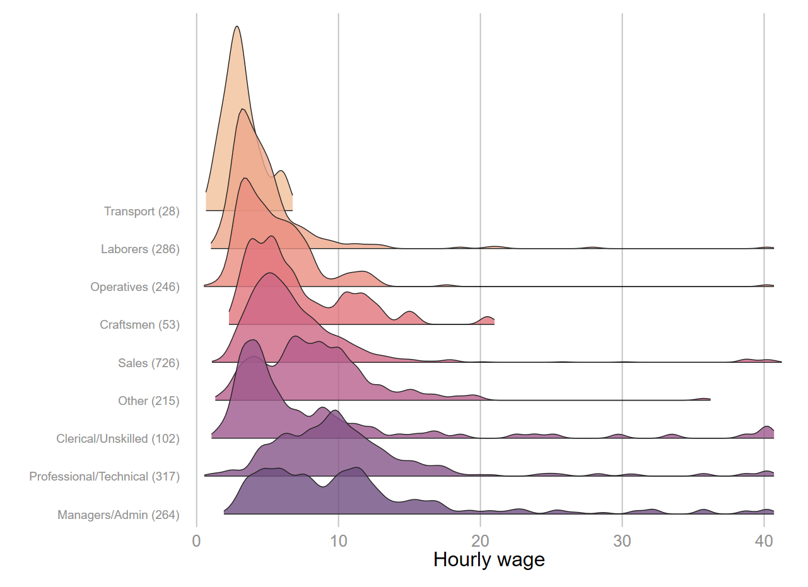
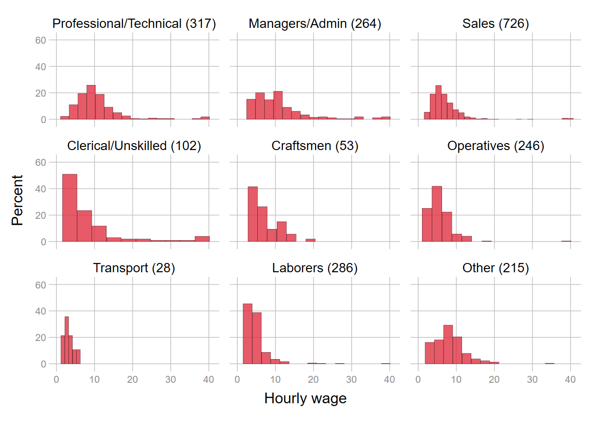

Une petite commande sans trop de prétention.  

* Permet d'ajouter sur l'axe discret d'un graphique, le nombre d'observations de chaque modalité.
* On peut également l'utiliser, avec une manipulation supplémentaire, pour les modèles.

**Installation**  

`net install addnlab, from("https://raw.githubusercontent.com/mthevenin/stata_graphiques/master/ressources/addnlab/") replace`


**Syntaxe**  

`addnlab varlist  [if/in] , [back]`

* On ne peut pas exécuter deux fois de suite si au moins une variable dans la liste à déjà les effectifs affecter au label. 
* On revient au label d'origine en ajoutant l'option **`back`**.

**Exemples graphiques**  

```{}
sysuse nlsw88, clear
recode occupation (9 10 11 12 = 13 )

addnlab  occupation 
gridge wage, over(occupation) sortrev(mean) range(0 50) palette(flare) bw(.5)
```




Si on oublie de revenir sur le label d'origine avec l'option `back` et qu'on réexécute de nouveau `addnlab occupation`, le message suivant apparaît.

```{
addnlab occupation

One or more variables have already the number of observations added to label
First, execute: addnlab varlist, back
varlist: previous variable(s) added to addnlab
```

```{stata, eval=F}
tw histogram wage, by(occupation, note(" "))    fc("225 50 67%80") lc(black) lw(*.2) percent
addnlab  occupation, back
```




**Exemple Régression**  

La manipulation supplémentaire est particulièrement simple: On exécute le modèle une première pour récupérer la sélection de l'échantillon avec **`e(sample)`**. 

```{}
sysuse nlsw88, clear

recode occupation (9 10 11 12 = 13 )

regress wage  i.occupation i.south i.race ttl_exp  if married==1
```

```{}
-----------------------------------------------------------------------------------------
                   wage | Coefficient  Std. err.      t    P>|t|     [95% conf. interval]
------------------------+----------------------------------------------------------------
             occupation |
Professional/Technical  |      0.000  (base)
        Managers/Admin  |     -0.002      0.525    -0.00   0.997       -1.032       1.028
                 Sales  |     -2.969      0.415    -7.16   0.000       -3.783      -2.156
    Clerical/Unskilled  |     -1.413      0.710    -1.99   0.047       -2.805      -0.021
             Craftsmen  |     -2.451      0.935    -2.62   0.009       -4.286      -0.617
            Operatives  |     -3.939      0.560    -7.03   0.000       -5.038      -2.840
             Transport  |     -4.862      1.443    -3.37   0.001       -7.691      -2.032
              Laborers  |     -4.346      0.531    -8.19   0.000       -5.387      -3.305
                 Other  |     -1.650      0.525    -3.14   0.002       -2.681      -0.620
                        |
                  south |
             Not south  |      0.000  (base)
                 South  |     -1.140      0.275    -4.15   0.000       -1.679      -0.602
                        |
                   race |
                 White  |      0.000  (base)
                 Black  |      0.057      0.352     0.16   0.872       -0.634       0.748
                 Other  |      0.728      1.183     0.62   0.539       -1.592       3.048
                        |
                ttl_exp |      0.256      0.030     8.51   0.000        0.197       0.315
                  _cons |      7.161      0.549    13.03   0.000        6.083       8.239
-----------------------------------------------------------------------------------------
```

On affecte enfin `e(sample)` à `addnlab`.  


```{}
addnlab married occupation south race if e(sample)

regress wage  i.occupation i.south i.race ttl_exp if married==1

addnlab married occupation south race, back
```

```{}
-----------------------------------------------------------------------------------------------
                         wage | Coefficient  Std. err.      t    P>|t|     [95% conf. interval]
------------------------------+----------------------------------------------------------------
                   occupation |
Professional/Technical (204)  |      0.000  (base)
        Managers/Admin (158)  |     -0.002      0.525    -0.00   0.997       -1.032       1.028
                 Sales (499)  |     -2.969      0.415    -7.16   0.000       -3.783      -2.156
     Clerical/Unskilled (66)  |     -1.413      0.710    -1.99   0.047       -2.805      -0.021
              Craftsmen (33)  |     -2.451      0.935    -2.62   0.009       -4.286      -0.617
            Operatives (136)  |     -3.939      0.560    -7.03   0.000       -5.038      -2.840
              Transport (13)  |     -4.862      1.443    -3.37   0.001       -7.691      -2.032
              Laborers (167)  |     -4.346      0.531    -8.19   0.000       -5.387      -3.305
                 Other (162)  |     -1.650      0.525    -3.14   0.002       -2.681      -0.620
                              |
                        south |
             Not south (838)  |      0.000  (base)
                 South (600)  |     -1.140      0.275    -4.15   0.000       -1.679      -0.602
                              |
                         race |
                White (1147)  |      0.000  (base)
                 Black (273)  |      0.057      0.352     0.16   0.872       -0.634       0.748
                  Other (18)  |      0.728      1.183     0.62   0.539       -1.592       3.048
                              |
                      ttl_exp |      0.256      0.030     8.51   0.000        0.197       0.315
                        _cons |      7.161      0.549    13.03   0.000        6.083       8.239
-----------------------------------------------------------------------------------------------
```


