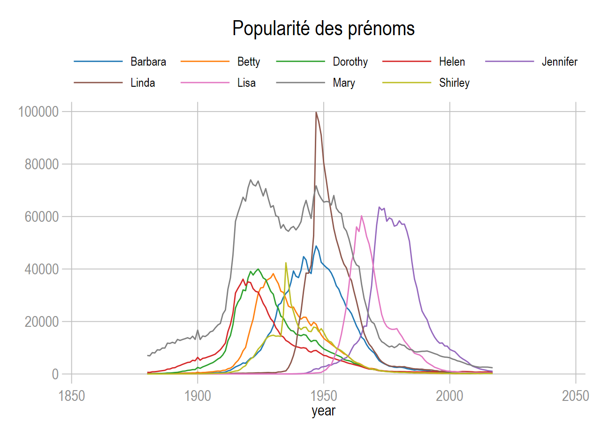
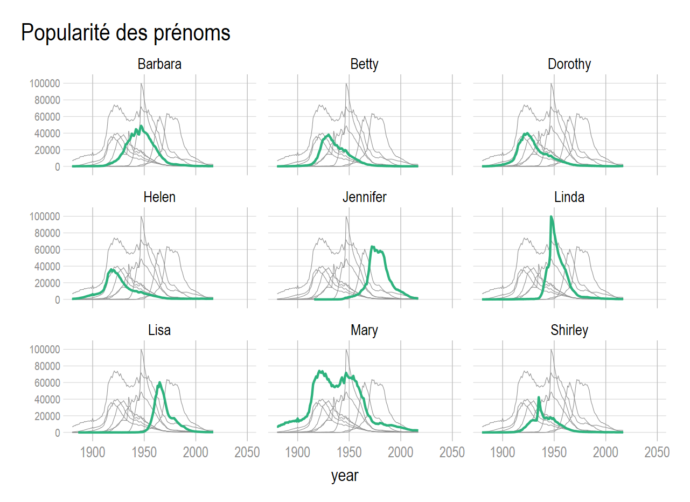

La commande **`fabplot`** programmée en 2021 par Nj.Cox permet de contrôler efficacement les effets dits *spaghetti* (courbes) ou *paella* (nuages de points). J'ai ajouté une option pour modifier les courbes au second plan, NJ.Cox ayant toujours tendance à bloquer l'habillage de ces commandes graphiques. La commande a été renommée **`fabplot2`** et s'installe via github. Bien évidemment, tout le mérite revient à l'auteur d'origine, l'ajout de l'option ne m'a pris que quelques dizaines de secondes.

[**Article Stata Journal**](https://journals.sagepub.com/doi/full/10.1177/1536867X211025838) 

J'avais présenté le problème lors de la formation de 2020, mais avec un programme très compliqué. Cette commande très simple, permet de bien contrôler ce problème visualisation en utilisant sur deux objets graphiques l'option `by`.....pourquoi je n'y avais pas pensé.


# Installation

## `fabplot`

Commande d'origine. L'objet en arrière plan n'est pas modifiable.

```{r eval=FALSE}
ssc install fabplot

* help fabplot
```

## `fabplot2`

J'ai juste ajouté l'option **`backopts`**. Même principe que l'option **`frontopts`** qui modifie l'objet au premier plan.

```{r eval=FALSE}
net install fabplot2, from("https://raw.githubusercontent.com/mthevenin/stata_graphiques/master/ressources/fabplot2/") replace
```

## Exemple


> **Note** J'utilise systématiquement un thème  que je génère avec le paquet **`grstyle`** de B.Jann.  


Je reprends le même exemple que pour la formation, avec la base babynames.  
Ouverture de de la base:  

```{r eval=FALSE}
webuse set "https://raw.githubusercontent.com//mthevenin/stata_graphiques/master/ressources/fabplot2"
use babynames, clear
webuse set
```

### Empilement des 9 courbes

..... C'est illisible

```{r eval=FALSE}
* thème avec grstyle
grstyle init 
grstyle set mesh
grstyle set color tableau, n(9)

* Graphique
levelsof name, local(name)
local i = 1
foreach nom of local name  {
local j = `i++'	
local line `line' line n year if name=="`nom'" ||		
local leg `leg'  `j' "`nom'"
}

tw `line' , legend(order(`leg') row(2) size(*.8)  region(color(%0)) pos(11)) ytitle("") ylabel(0(20000)100000, angle(0)) ///
title("Popularité des prénoms")
```




# Small-Multiple avec fabplot

Avec un graphique de type statique, une solution à priviliégier serait un graphique de type ***small-multiple*** en conservant les autres courbes en arrière plan. Avec Stata, ce type de graphique est exécuté avec l'option **`by()`**. 

## Syntaxe allégée

**`fabplot[2] command yvar xvar [if] [in], by(byvar [,byopts]) [frontopts() backopts()] ....`**

* `fabplot[2]`: `fabplot` ou `fabplot2`
* `command`: **line** ou **scatter**
* `by(byvar [,opts)]`: indiquer à minima la variable catégorielle qui produira chaque sous graphique. Beaucoup d'options du graphique entre sans cette option, comme les titres ou la couleur du background
* `frontopts`: les options de l'objet graphique en relief, comme la couleur et l'épaisseur de la courbe ou des marqueurs
* `backopts`: avec `fabplot2` seulement, les options de l'objet graphique en arrière plan.

## Application

```{r eval=FALSE}
#delimit ;

fabplot2 line n year, 
by(name, title("Popularité des prénoms", pos(11))) 

frontopts(lw(*2) lc("45 178 125")) 
backopts(lw(*.5) lc(gs9)) 

ytitle("")  ylabel(0(20000)100000, labsize(*.8) glw(*.5))
; 

#delimit cr
```


