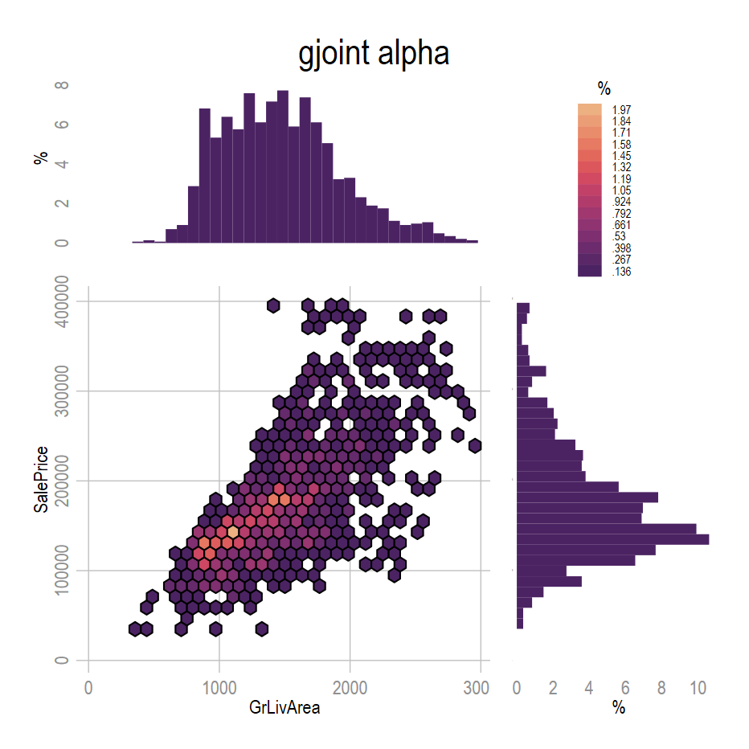

**Commande `gjoint`**

- graphique combiné pour deux variables quantitatives
  - distributions marginales sous forme d'histogramme
  - distribution croisée avec la commande `hexplot` de Ben Jann
- Version très *alpha*

