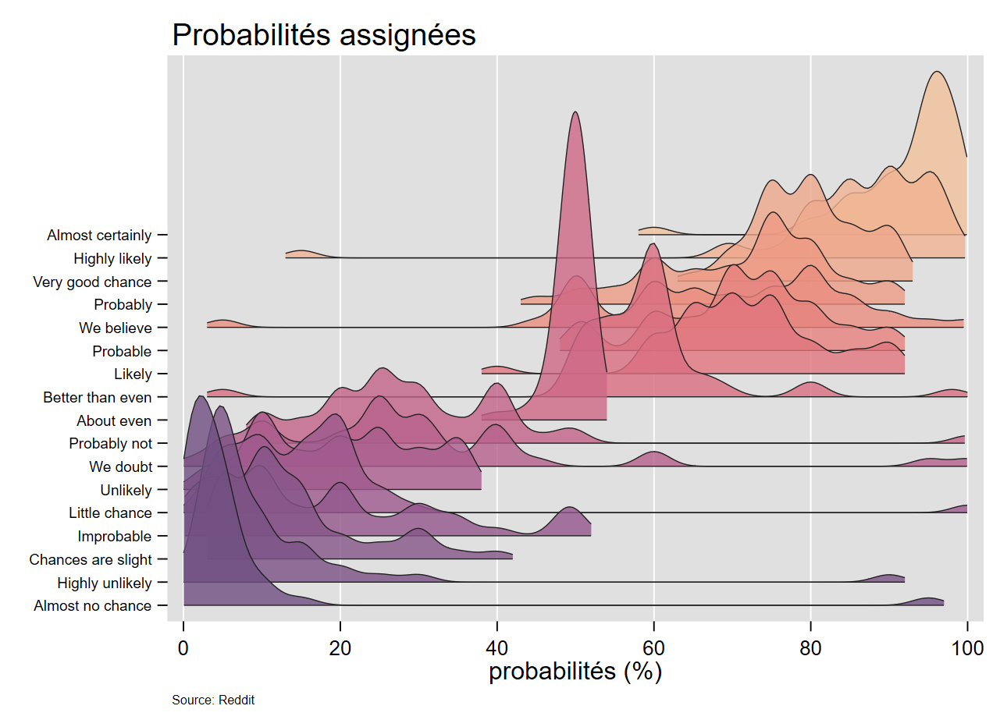
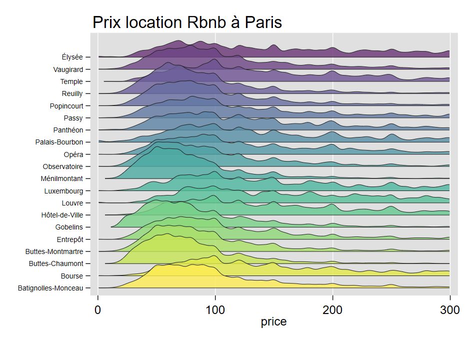
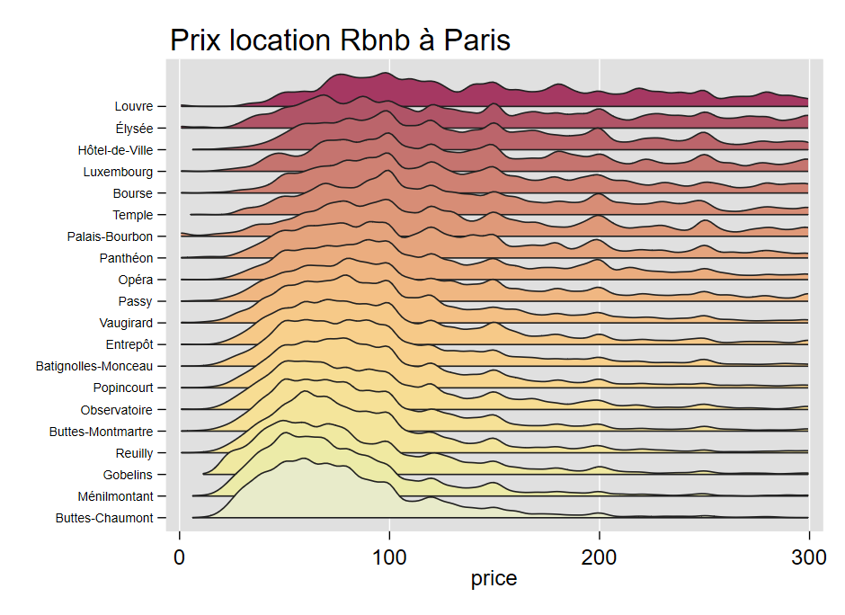

Depuis 2020, des programmes permettent de générer de type lignes de crête, en particulier celle d'A.Naqvi (`joyplot`).




A partir d'un programme écrit à l'automne 2020, et en restant au plus près de la fonction `ggridge` de R, j'ai également (et modestement) programmé une commande. Elle permet, entre autres, de contrôler le tri les modalités de l'axe discret à partir d'une fonction compatible avec `egen` (*mean*, *median*, *sd*....), de choisir librement un intervalle sur l'axe des abscisses pour éviter le report de valeurs sortant d'une borne acceptable (probabilité négatives ou supérieure à 1 dans l'exemple). Comme  on estime des densités, le nombre d'observations minimales a été fixé à 10. Si ce critère n'est pas respecté, les valeurs de y en cause  sont affichées.  Des améliorations restent néanmoins à prévoir.


## Installation

```{r eval=FALSE}
net install gridge, from("https://raw.githubusercontent.com/mthevenin/stata_graphiques/master/ressources/gridge/") replace
```

# Syntaxe

```{r eval=FALSE}
syntax variable [if],                                                                ///
over(variable)  super(numeric 1.8)                                                   ///
sort(string)  sortrev(string) bw(real>0 1.5)                                         ///
palette(string) colrev opac(integer 80)  lc(integer 2)] lw(real .5)] gopts(string)]  ///   
range(value1 value2)   
```

*Entre parenthèse le type d'argument, suivi si nécessaire de la valeur par défaut.* 

**Arguments**  

- `over(variable)`: variable de stratification. De type numérique avec ou non un label
- `super(numeric 1.8)`: degré de superposition des densités. Positif de préférence.
- `sort(string)`: **mean**, **median**, **sd**, **iqr**, **mode** (ou autre fonction statistique compatible avec `egen`)
- `sortrev(string)` - `sortr(string)`: idem mais les valeurs de la variable `over()` seront affichées en ordre décroissant
- `bw(real>0 1.5)`: largeur de la fenêtre de lissage.
- `palette(string)`  `pal(string)`: nom d'une palette du package `colorpalette`. Ce dernier sera installé comme dépendance si nécessaire. L'ordre des couleurs sera inversé par rapport à palette sélectionnée. 
- `colrev`: permet d'inverser l'ordre des couleurs de la palette. Permet de retrouvet l'ordre de la palette d'origine de `colorpalette`
- `opac(integer 80)`: % d'opacité des couleurs. Valeur max = 100
- `range(value1 value2)`: permet de borner les valeurs de l'axe continu (x). value1 $<$ value2
-  `lc(integer 2)`: échelle de gris du contour des densités (palette **gs**). Valeurs comprise entre 1 (noir) et 15 (blanc)
- `lw(real .5)`: épaisseur du contour des densités en valeur relative. Valeur minimum 0
- `gopts(string)`: autres options des graphique de type `tw`: titre, xlabel, plotr, graphr.... **Ne pas utiliser l'option `ylabel`** (option spécifique à venir).            

**Remarques**  

- Pour la variable de l'argument `over()`, chaque valeur doivent avoir au moins 10 observations. Si ce n'est pas le cas, la commande n'exécutera pas le graphique mais affichera les valeurs dont le nombre d'observation est insuffisant.
- Toujours pour la variable de l'argument `over()`, j'ai pour l'instant limité le format de la variable à un format numérique, avec ou sans labels affectés aux valeurs.
- Ce type de visualisation est également utilisée pour représenter comparer l'évolution dans le temps d'une variable quantitative, par exemple entre pays (très à la mode avec le COVID): <https://www.ined.fr/fichier/rte/166/Page%20accueil/SDR_plot_all_countries_fr.jpg>. Cela permet d'offrir un certain contrôle des effets dits "spaghetti", mais je préfère dans ce cadre les approches de type *small-multiple*. Par ailleurs, dans l'esprit des courbes de Ridge, l'axe Y est plutôt de type ordonné. Cette option est offerte dans la fonction `joyplot` (A.Navqui).

                                                                                             
# Exemple 1

***Ouverture de la base***
```{r eval=FALSE}
webuse set  "https://raw.githubusercontent.com//mthevenin/stata_graphiques/master/ressources/gridge"
webuse "probability.dta", clear
webuse set
```
  
  
***Graphique***
```{r eval=FALSE}
#delimit;
gridge p , over(proba) 
range(0 100) bw(2) 
palette(flare) op(90)

gopts(title("Probabilités assignées", pos(11))
caption("Source: Reddit", size(*.5)) 
xtitle("probabilités (%)")) 
;
```


# Exemple 2

Dans le premier exemple, les modalités de l'axe discret était ordonnée. Avec cet exemple, Le premier graphique représente la série de distributions suivant l'ordre des valeurs par défaut de la variable *zône*. Le second graphique avec l'option `sort(median)` trie de manière croissante les secteurs selon la valeur médiane du prix de la location, enfin le troisième applique un tri décroissant avec l'option `sortrev(median)`.  

***Ouverture de la base***
```{r eval=FALSE}
webuse set https://github.com/mthevenin/stata_graphiques/tree/main/bases
use rbnb_paris, replace
webuse set
```

***Graphique 1***
```{r eval=FALSE}
gridge price if price<=300, over(zone) bw(4) gopts(title("Prix location Rbnb à Paris", pos(11))) range(0 300)
```

***Graphique 2***
```{r eval=FALSE}
#delimit ;
gridge price, 
over(zone)  super(2) palette(HCL heat2) bw(4) lc(2) lw(.8) sort(mean)
gopts(title("Prix location Rbnb à Paris", pos(11))) range(0 300) op(100)
;
```



***Graphique 3***
```{r eval=FALSE}
#delimit ;
gridge price, 
over(zone)  super(2) palette(HCL heat2) bw(4) lc(2) lw(.8) sortrev(mean) colrev
gopts(title("Prix location Rbnb à Paris", pos(11)))
;
```



# Nombre d'observations insuffisantes pour estimer les densités

Le seuil à été fixé à 10 observations. Si ce n'est pas le cas, le graphique n'est pas exécuté mais les informations sur les valeurs de y qui manquent d'informations sont indiquées

```{r eval=FALSE}
webuse nhanes2, clear

gen bmi2 = round(bmi)
gridge bpsystol, over(bmi2)

/*
bmi2=12: nombre d'observations insuffisant pour estimer les densités
bmi2=14: nombre d'observations insuffisant pour estimer les densités
bmi2=15: nombre d'observations insuffisant pour estimer les densités
bmi2=46: nombre d'observations insuffisant pour estimer les densités
bmi2=47: nombre d'observations insuffisant pour estimer les densités
bmi2=48: nombre d'observations insuffisant pour estimer les densités
bmi2=49: nombre d'observations insuffisant pour estimer les densités
bmi2=51: nombre d'observations insuffisant pour estimer les densités
bmi2=52: nombre d'observations insuffisant pour estimer les densités
bmi2=53: nombre d'observations insuffisant pour estimer les densités
bmi2=54: nombre d'observations insuffisant pour estimer les densités
bmi2=55: nombre d'observations insuffisant pour estimer les densités
bmi2=57: nombre d'observations insuffisant pour estimer les densités
bmi2=61: nombre d'observations insuffisant pour estimer les densités
 Exit: nombre d'observations minimum = 10
 */
```


